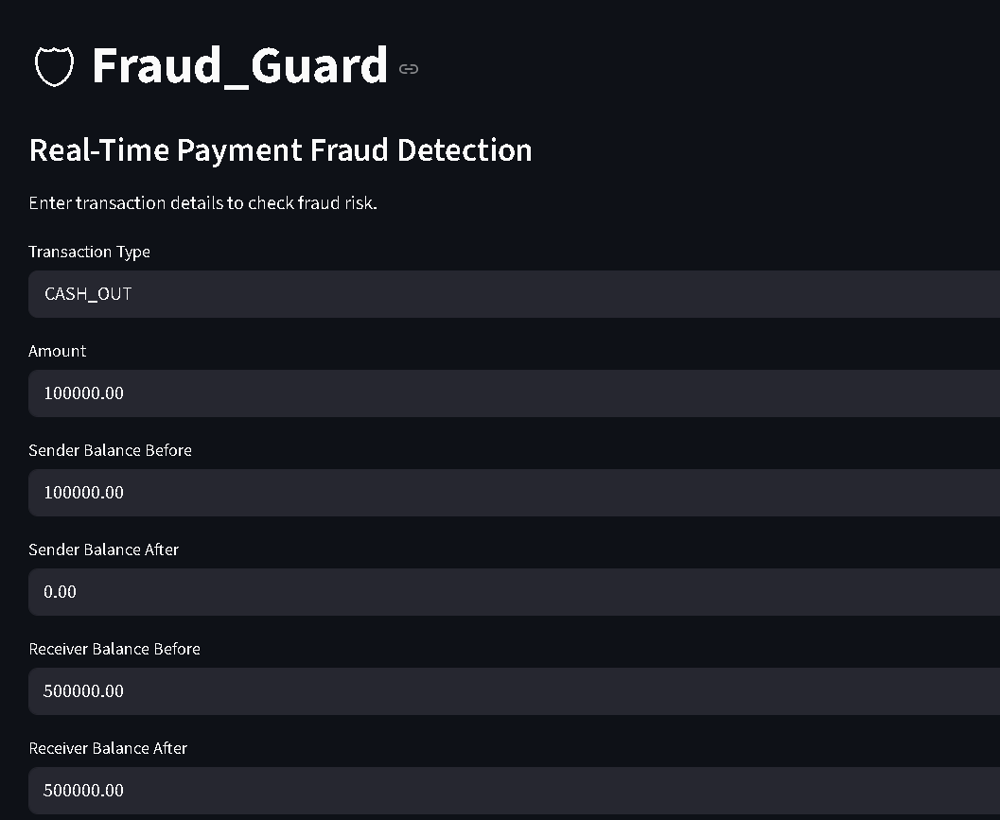
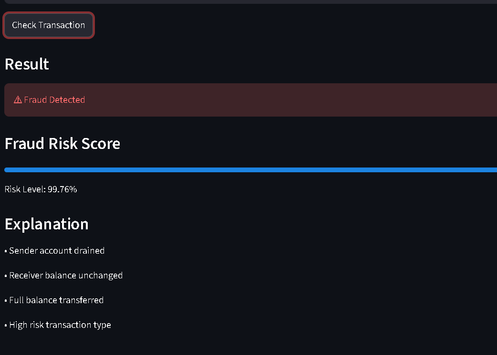

# 🛡 Fraud_Guard – Financial Fraud Detection

An **End-to-End Machine Learning project** that detects fraudulent financial transactions and provides an **interactive dashboard for prediction and analysis**.

The system analyzes transaction details such as amount, balances, and transaction type to determine whether a transaction is **legitimate or fraudulent**.

Dataset used:
PaySim Mobile Money Fraud Simulation Dataset

---

# 🚀 Features

* Fraud prediction using Machine Learning
* Feature engineering for fraud signals
* Handles imbalanced datasets using SMOTE
* Interactive fraud detection dashboard
* Transaction history tracking
* Fraud analytics with charts

---

# 🧠 Machine Learning Pipeline

1️⃣ Data preprocessing
2️⃣ Feature engineering
3️⃣ Handling class imbalance (SMOTE)
4️⃣ Model training using **Random Forest**
5️⃣ Model evaluation (ROC-AUC, Precision, Recall)
6️⃣ Dashboard deployment

---

# 🖥 Dashboard

The project includes a dashboard built with Streamlit.

Dashboard features:

* 🔍 **Fraud Detection** – predict if a transaction is fraud
* 📜 **Transaction History** – store checked transactions
* 📊 **Analytics** – visualize fraud patterns with charts

Charts powered by Plotly.

---

## Dashboard Prediction




---

# 📂 Project Structure

```
fraud-detection-system
|
├── models/
│   ├── fraud_model.pkl
│   ├── scaler.pkl
│   └── type_encoder.pkl
│
├── notebooks/
│   └── fraud_model.ipynb
│
├── train.py
├── app.py
├── requirements.txt
└── README.md
```

---

# ▶️ Run the Project

### 1️⃣ Install dependencies
pip install -r requirements.txt
```

### 2️⃣ Train the model
python train.py
```

### 3️⃣ Run the dashboard
streamlit run app.py
```

### Open in browser:
http://localhost:8501
```

---

## Dataset

This project uses the [PaySim dataset](https://www.kaggle.com/datasets/ntnu-testimon/paysim1). 
You can download the CSV file manually from Kaggle and place it in the project folder. 

# 🛠 Tech Stack

* Python
* Pandas & NumPy
* Scikit-Learn
* Imbalanced-Learn
* Streamlit
* Plotly

---

# 🎯 Project Goal

This project demonstrates how **machine learning can be used in fintech systems to detect suspicious transactions and prevent fraud in real time**.

